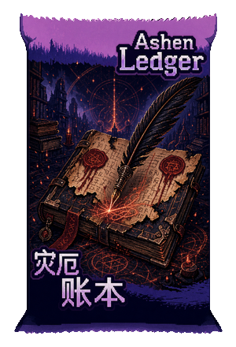

# WAJ Modder

English | [中文](#中文)

WAJ Modder is an unofficial Codex skill for creating and validating Lua-template mods for **Witch's Apocalyptic Journey** from natural-language ideas.

It is intended for creators who have mod ideas but may not know Lua, C#, the game's CSV tables, or the asset pipeline yet.

## Contents

- [Status](#status)
- [How To Use](#how-to-use)
- [What v0 Handles Well](#what-v0-handles-well)
- [Asset Generation Scope](#asset-generation-scope)
- [Current Boundaries](#current-boundaries)
- [Official Tutorial](#official-tutorial)
- [Demo](#demo)
- [Model Note](#model-note)
- [License](#license)
- [中文](#中文)

## Status

This is a v0 skill. Treat generated mods as testable drafts, not guaranteed final releases.

The current version is strongest at two things:

- Building Lua-template card-pack mods from natural-language design notes.
- Guiding and post-processing generated visual assets, especially card-pack covers, card art, Buff icons, and relic icons.

## How To Use

The simplest workflow is:

1. Open Codex or another AI coding assistant that supports installing skills or reading GitHub repositories.
2. Give it this repository link:

   ```text
   https://github.com/Mr-Pardon/WAJ-Modder
   ```

3. Tell it something like:

   ```text
   Please use this WAJ Modder skill/repository to help me create a Witch's Apocalyptic Journey mod.
   My idea is: <describe your card pack, mechanic, cards, theme, or visual style>.
   ```

4. Let the assistant install/read the skill, inspect the official tutorial if needed, ask follow-up questions, generate the mod files, generate or guide assets, and run validation.

If automatic skill installation is not available, ask the assistant to read `SKILL.md` and the files under `references/`, then follow the documented workflow manually.

## What v0 Handles Well

- Lua-template card-pack mods.
- Card, Buff, relic, basic blessing, keyword, and card-pack CSV rows.
- Matching `Data` / `Text` entries.
- Runtime ID references:
  - Original game references: `<CsvFileName>_<RawId>`
  - Mod references: `<ModFolder>_<CsvFileName>_<RawId>`
- `PackBelong` ownership for cards and relics.
- Dynamic card descriptions through `{0}`, `{1}` placeholders and `AddDescription`.
- Generated image asset guidance and post-processing.
- Card-pack cover, Buff icon, relic icon, and card-art constraints.
- Local static validation before in-game testing.
- Basic Workshop publishing preparation.

## Asset Generation Scope

Asset generation is a core part of v0. The skill does not simply ask for "pixel art"; it records practical size, prompt, style, and post-processing rules discovered during testing.

Stable or relatively constrained:

- **Card-pack cover**: generate a complete portrait cover using the card-pack layout rules, then finalize to `300x440` with `scripts/finalize_cardpack_cover.py`. The current prompt pattern supports integrated English and Chinese title art, wrapper bands, transparent silhouette, and green-edge cleanup.
- **Card art**: practical default is `512x512` square art. The style guide emphasizes a dark quiet background, one readable subject, and a restrained palette.
- **Buff icon**: final PNG must be `31x31`. Use `assets/buff-border-atlas.png`; negative/debuff icons use the red frame, while positive or neutral Buffs can use non-red frames until official semantics are confirmed.
- **Relic icon**: final PNG should be `128x128`, square, framed, and object-centered.
- **Mod/workshop icon**: square image, usually derived from the pack cover or a dedicated generated icon.

Useful references:

- `references/asset-style-guide.md`
- `references/assets-and-publishing.md`
- `references/cardpack-cover-layout.md`
- `references/cardpack-cover-prompt-examples.md`

Not yet tightly constrained:

- Blessing icons.
- Keyword icons.
- Character portraits and animation frames.
- Enemy intent icons.
- Dialogue/event illustrations.
- Any asset type without a verified official reference or tested published example.

For unconstrained categories, the skill should ask for references when possible and clearly report that in-game verification is required.

## Current Boundaries

The skill can provide guidance for these topics, but they are not yet tightly constrained in v0:

- Complex C# DLL hooks.
- Broad runtime patches or global listeners.
- Advanced UI changes.
- Character animation pipelines.
- Automatic live game-log streaming back into Codex.
- Asset types where no official size or frame references have been verified.

The preferred v0 path is data-driven and Lua-template based. Use C# hooks only when the user explicitly wants advanced experimental work.

## Official Tutorial

The official tutorial is not bundled in this skill. When needed, the skill checks for a local `mod-tutorial` or `apocalyptic-journey-mod-tutorial` directory and can fetch:

```text
https://github.com/meowalive/apocalyptic-journey-mod-tutorial.git
```

## Demo

Ashen Ledger is a Workshop demonstration mod created to show the v0 skill boundary and output style.

Workshop link: [AshenLedger]((https://steamcommunity.com/sharedfiles/filedetails/?id=3742034084))

The screenshot below captures one full AI-assisted generation pass: content summary, generated assets, card-pack cover, asset sheets, and static validation output.


The card-pack cover below is a successful v0 asset-generation result created from the skill's card-pack cover prompt pattern, then finalized to `300x440`.



## Model Note

The Ashen Ledger demo shown in this repository was produced with GPT-5.5. Model capability matters: different language models, image models, prompts, and context can produce different implementation quality, asset style, and reliability. The v0 boundaries above should be read as the demonstrated result for this model-assisted workflow, not as a guarantee that every model will match it.

## License

MIT License, copyright (c) 2026 Mr_Pardon.

See `LICENSE` and `NOTICE.md`.

---

## 中文

WAJ Modder 是一个非官方 Codex skill，用来根据自然语言创意，协助创建和校验《魔女：终末旅途》的 Lua 模板模组。

它面向的是“有模组想法，但不熟悉 Lua、C#、游戏 CSV 表结构或素材流程”的创作者。

## 目录

- [状态](#状态)
- [怎么使用](#怎么使用)
- [v0 比较稳定的能力](#v0-比较稳定的能力)
- [素材生成范围](#素材生成范围)
- [当前边界](#当前边界)
- [官方教程](#官方教程)
- [展示模组](#展示模组)
- [模型说明](#模型说明)
- [许可](#许可)

## 状态

这是 v0 版本 skill。生成结果应该被视为“可测试草稿”，不是无需验证的最终发布版本。

当前版本最强的两个方向是：

- 根据自然语言设计创建 Lua 模板卡包模组。
- 指导并后处理生成素材，尤其是卡包封面、卡面、Buff 图标和遗物图标。

## 怎么使用

最简单的方式是：

1. 打开 Codex 或其他支持读取 GitHub 仓库 / 安装 skill 的 AI 编程工具。
2. 把这个仓库链接发给它：

   ```text
   https://github.com/Mr-Pardon/WAJ-Modder
   ```

3. 然后告诉它：

   ```text
   请使用这个 WAJ Modder skill / 仓库，帮我开发一个《魔女：终末旅途》的模组。
   我的创意是：<描述你的卡包、机制、卡牌、主题或美术风格>。
   ```

4. 之后让 AI 读取或安装 skill，必要时检查官方教程，向你追问设计细节，生成模组文件，生成或指导素材，并运行校验。

如果你的 AI 工具不能自动安装 skill，也可以让它直接阅读 `SKILL.md` 和 `references/` 目录下的文档，然后按里面的流程执行。

## v0 比较稳定的能力

- Lua 模板卡包模组。
- 卡牌、Buff、遗物、基础祝福、关键词和卡包 CSV 行。
- `Data` / `Text` 表配对。
- 运行时 ID 引用：
  - 原版引用：`<CsvFileName>_<RawId>`
  - 模组引用：`<ModFolder>_<CsvFileName>_<RawId>`
- 通过 `PackBelong` 处理卡牌和遗物的卡包归属。
- 通过 `{0}`、`{1}` 占位符和 `AddDescription` 处理动态卡牌描述。
- 生成图片素材的提示、尺寸和后处理规则。
- 卡包封面、Buff 图标、遗物图标和卡面素材约束。
- 进游戏测试前的本地静态校验。
- 基础创意工坊发布准备。

## 素材生成范围

素材生成是 v0 的重要能力。这个 skill 不只是简单提示“像素风”，而是记录了测试过程中沉淀下来的尺寸、提示词、风格和后处理规则。

相对稳定或已经约束：

- **卡包封面**：生成完整竖版卡包封面，然后用 `scripts/finalize_cardpack_cover.py` 后处理为 `300x440`。当前提示词模式支持中英文标题融入画面、包装边缘、透明外形和绿色边缘清理。
- **卡面**：当前实践默认是 `512x512` 方图。风格上强调深色安静背景、清晰主体和克制配色。
- **Buff 图标**：最终 PNG 必须是 `31x31`。使用 `assets/buff-border-atlas.png`；负面 / debuff 使用红色边框，正面或中性 Buff 暂时可使用非红色边框。
- **遗物图标**：最终 PNG 建议为 `128x128`，方形、带边框、中心物件清晰。
- **模组 / 工坊图标**：方形图片，通常可以从卡包封面或单独生成的图标裁切得到。

有用的参考文档：

- `references/asset-style-guide.md`
- `references/assets-and-publishing.md`
- `references/cardpack-cover-layout.md`
- `references/cardpack-cover-prompt-examples.md`

暂未严格约束：

- 祝福图标。
- 关键词图标。
- 角色头像和动画帧。
- 敌人攻击意图图标。
- 对话 / 事件插图。
- 任何尚未验证官方参考或发布样例的素材类型。

对于暂未约束的素材类型，skill 应优先询问参考图，并明确说明仍需要进游戏验证。

## 当前边界

skill 可以为以下方向提供指导，但 v0 暂时还没有同样严格的约束：

- 复杂 C# DLL hook。
- 大范围运行时补丁或全局监听。
- 高级 UI 修改。
- 角色动画流程。
- 游戏日志实时回传到 Codex。
- 尚未验证官方尺寸或边框参考的素材类型。

v0 推荐路径是数据驱动和 Lua 模板。只有在用户明确要求高级实验功能时，才建议考虑 C# hook。

## 官方教程

本 skill 不内置官方教程仓库。需要时，skill 会先查找本地 `mod-tutorial` 或 `apocalyptic-journey-mod-tutorial` 目录，也可以拉取：

```text
https://github.com/meowalive/apocalyptic-journey-mod-tutorial.git
```

## 展示模组

Ashen Ledger / 灾厄账本 是一个创意工坊展示模组，用于说明 v0 skill 的能力边界和输出风格。

创意工坊链接：[灾厄账本](https://steamcommunity.com/sharedfiles/filedetails/?id=3742034084)

下图记录了一次完整 AI 协助生成流程：内容摘要、生成素材、卡包封面、素材板和静态校验结果。


下图是一次成功的 v0 卡包封面生成结果：由 skill 的卡包封面提示词模式生成，然后后处理为 `300x440`。


## 模型说明

本仓库展示的 Ashen Ledger 示例使用 GPT-5.5 生成与协助完成。模型能力会直接影响结果：不同语言模型、图像模型、提示词和上下文，可能带来不同的实现质量、素材风格和稳定性。因此，上方 v0 能力边界应理解为该模型辅助流程下的展示结果，而不是所有模型都能完全复现的保证。

## 许可

MIT License, copyright (c) 2026 Mr_Pardon。

详见 `LICENSE` 和 `NOTICE.md`。
