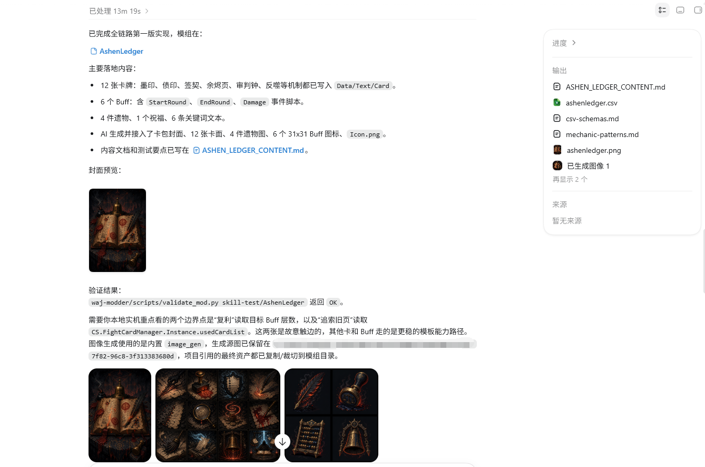

# WAJ Modder

English | [中文](#中文)

WAJ Modder is an unofficial Codex skill for creating and validating Witch's Apocalyptic Journey Lua-template mods from natural-language ideas.

It is intended for mod authors who have design ideas but may not know Lua, C#, or the game's CSV conventions yet.

## Contents

- [Status](#status)
- [What v0 Handles Well](#what-v0-handles-well)
- [Current Boundaries](#current-boundaries)
- [Official Tutorial](#official-tutorial)
- [Demo](#demo)
- [License](#license)
- [中文](#中文)

## Status

This is a v0 skill. Treat generated mods as testable drafts, not guaranteed final releases.

## What v0 Handles Well

- Lua-template card-pack mods
- Card, Buff, relic, blessing, keyword, and card-pack CSV rows
- Matching `Data` / `Text` entries
- Runtime ID references
- `PackBelong` ownership for cards and relics
- Dynamic card descriptions through placeholders and `AddDescription`
- Generated image asset guidance and post-processing
- Card-pack covers, Buff icons, and relic icon size checks
- Local static validation before in-game testing
- Basic publishing preparation

## Current Boundaries

The skill can provide guidance for these topics, but they are not yet tightly constrained in v0:

- Complex C# DLL hooks
- Broad runtime patches or global listeners
- Advanced UI changes
- Character animation pipelines
- Automatic live game-log streaming back into Codex
- Asset types where no official size or frame references have been verified

## Official Tutorial

The official tutorial is not bundled in this skill. When needed, the skill checks for a local `mod-tutorial` or `apocalyptic-journey-mod-tutorial` directory and can fetch:

```text
https://github.com/meowalive/apocalyptic-journey-mod-tutorial.git
```

## Demo

Ashen Ledger is a Workshop demonstration mod created to show the v0 skill boundary and output style.

Workshop link: TODO_WORKSHOP_URL

The screenshot below captures one full AI-assisted generation pass: content summary, generated assets, card-pack cover, asset sheets, and static validation output.



## License

MIT License, copyright (c) 2026 Mr_Pardon.

See `LICENSE` and `NOTICE.md`.

---

## 中文

WAJ Modder 是一个非官方 Codex skill，用于根据自然语言想法创建和校验《魔女：终末旅途》的 Lua 模板模组。

它面向有模组创意、但不熟悉 Lua、C# 或游戏 CSV 结构的创作者。

## 目录

- [状态](#状态)
- [v0 较稳定的能力](#v0-较稳定的能力)
- [当前边界](#当前边界)
- [官方教程](#官方教程)
- [展示模组](#展示模组)
- [许可](#许可)

## 状态

这是 v0 版本 skill。生成结果应被视为可测试草稿，而不是无需验证的最终发布版本。

## v0 较稳定的能力

- Lua 模板卡包模组
- 卡牌、Buff、遗物、祝福、关键词和卡包 CSV
- `Data` / `Text` 配对
- 运行时 ID 引用
- 通过 `PackBelong` 处理卡牌和遗物的卡包归属
- 通过占位符和 `AddDescription` 处理动态卡牌描述
- 生成图片素材的规格约束和后处理
- 卡包封面、Buff 图标、遗物图标的尺寸检查
- 进游戏测试前的本地静态校验
- 基础发布准备

## 当前边界

skill 可以为以下方向提供指导，但 v0 暂时还没有同样严格的约束：

- 复杂 C# DLL hook
- 大范围运行时补丁或全局监听
- 高级 UI 修改
- 角色动画流程
- 游戏日志实时回传到 Codex
- 尚未验证官方尺寸或边框参考的素材类型

## 官方教程

本 skill 不内置官方教程仓库。需要时，skill 会先查找本地 `mod-tutorial` 或 `apocalyptic-journey-mod-tutorial` 目录，也可以拉取：

```text
https://github.com/meowalive/apocalyptic-journey-mod-tutorial.git
```

## 展示模组

Ashen Ledger 是一个创意工坊展示模组，用于说明 v0 skill 的能力边界和输出风格。

创意工坊链接：TODO_WORKSHOP_URL

下图记录了一次完整 AI 协助生成流程：内容摘要、生成素材、卡包封面、素材板和静态校验结果。


## 许可

MIT License，copyright (c) 2026 Mr_Pardon。

详见 `LICENSE` 和 `NOTICE.md`。
